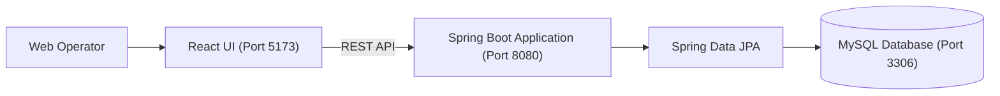
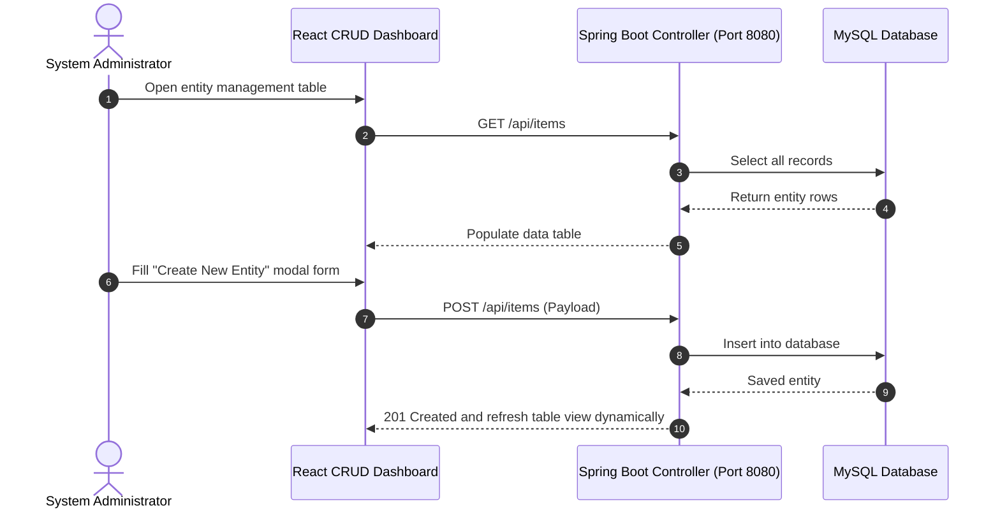

# FullStack Entity Manager — Spring Boot & React CRUD
[]()
[]()
[]()
[]()

## Overview
A full-stack enterprise data management application integrating a Java 17 Spring Boot REST API backend with a Vite + React frontend. Built to demonstrate full lifecycle CRUD operations (Create, Read, Update, Delete) against a relational MySQL database.

- **Problem Solved:** Robust data entry, validation, and administrative manipulation of relational entities.
- **Target Users:** Enterprise administrators, data operators, and software engineers.
- **Current Status:** Functional Full-Stack Application.

## Features
- **Full CRUD Workflow:** Create, view, modify, and delete relational data records.
- **Instant UI Synchronization:** React frontend updates table state immediately on data mutations.
- **RESTful Spring Boot API:** Clean controllers, DTO mapping, and JPA repository abstractions.
- **Data Validation:** Backend Bean Validation (`@Valid`, `@NotNull`) ensuring data integrity.

## Architecture


## User Flow


## Technology Stack
| Layer | Technology | Purpose |
|---|---|---|
| Frontend | React, Vite, CSS3 | Data table interface and edit dialogs |
| Backend | Java 17, Spring Boot 3 | Business rules, validation, and REST API |
| Database | MySQL 8.0 | Entity persistence |
| Build Tool | Maven, npm | Build lifecycle management |

## Infrastructure
- **Frontend Port:** 5173
- **Backend Port:** 8080
- **Database Port:** 3306

## Project Structure
```text
Fullstackapp/
├── backend/
│   ├── src/main/java/       # Spring Boot entity, repository, controller code
│   └── pom.xml              # Maven dependencies
├── frontend/
│   ├── src/                 # React components (DataTable, EditModal, Form)
│   ├── package.json         # React packages
│   └── vite.config.js       # Vite configuration
├── .gitignore               # Git ignore definitions
└── README.md                # Technical documentation
```

## Prerequisites
- JDK 17
- Node.js >= 18.x
- MySQL Server 8.0

## Environment Variables
Configure backend database connection in `application.properties`:
```properties
SPRING_DATASOURCE_URL=jdbc:mysql://localhost:3306/crudapp_db
SPRING_DATASOURCE_USERNAME=root
SPRING_DATASOURCE_PASSWORD=your_mysql_password
```

## Local Development Setup
1. Clone the repository:
   ```bash
   git clone https://github.com/Bhanutejanallamothu/Fullstackapp.git
   cd Fullstackapp
   ```
2. Start Backend:
   ```bash
   cd backend
   ./mvnw spring-boot:run
   ```
3. Start Frontend:
   ```bash
   cd ../frontend
   npm install
   npm run dev
   ```
4. Access web application at `http://localhost:5173`.

## Docker Setup
*Not detected in repository.*

## Database Setup
```sql
CREATE DATABASE crudapp_db;
```

## API Documentation
- `GET /api/items` - List all records.
- `GET /api/items/{id}` - Retrieve single record.
- `POST /api/items` - Create record.
- `PUT /api/items/{id}` - Update record.
- `DELETE /api/items/{id}` - Delete record.

## Deployment
Deploy backend executable JAR to cloud VM and host frontend build on static CDN.

## Security
- Input validation to reject malformed payload data.
- SQL injection mitigated via Hibernate parameterized criteria.

## Testing
```bash
cd backend && ./mvnw test
```

## Troubleshooting
- **Database Connection Error:** Verify MySQL service is running and user credentials are valid.

## Future Improvements
- Pagination and column sorting for high-volume datasets.

## License
Academic / Lab project. All rights reserved by repository owner.
